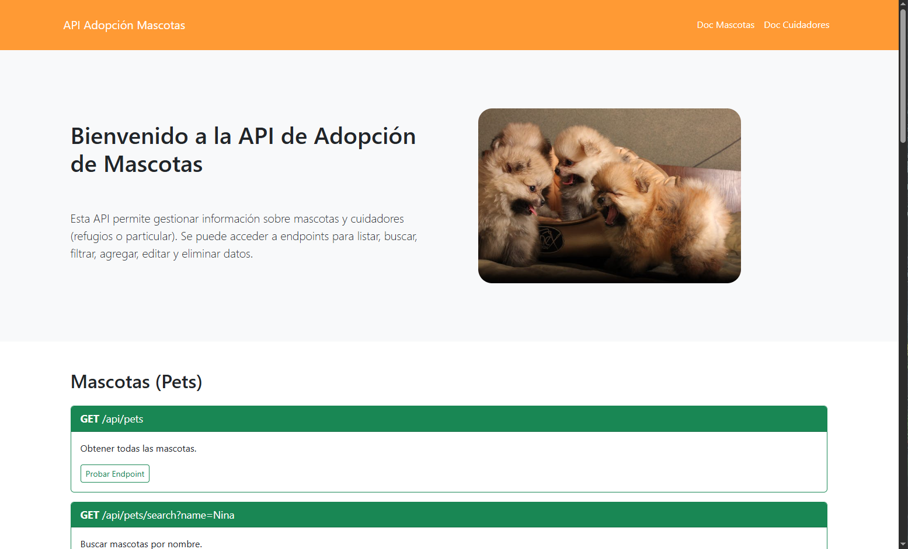

# 🐾 API de Adopción de Mascotas

## 👤 Datos de la alumna

- **Nombre y Apellido:** Nancy Correa
- **Materia:** Aplicaciones Híbridas
- **Docente:** Jonathan Emanuel Cruz
- **Comisión:** DWM4AP

## 📄 Descripción

Este proyecto es una API RESTful desarrollada con Node.js, Express y MongoDB. Permite gestionar información sobre mascotas y cuidadores, incluyendo operaciones de creación, lectura, actualización y eliminación (CRUD).

## 🛠️ Tecnologías utilizadas

- Node.js
- Express
- MongoDB (con Mongoose)
- Dotenv (para variables de entorno)
- HTML5
- CSS3 / Bootstrap